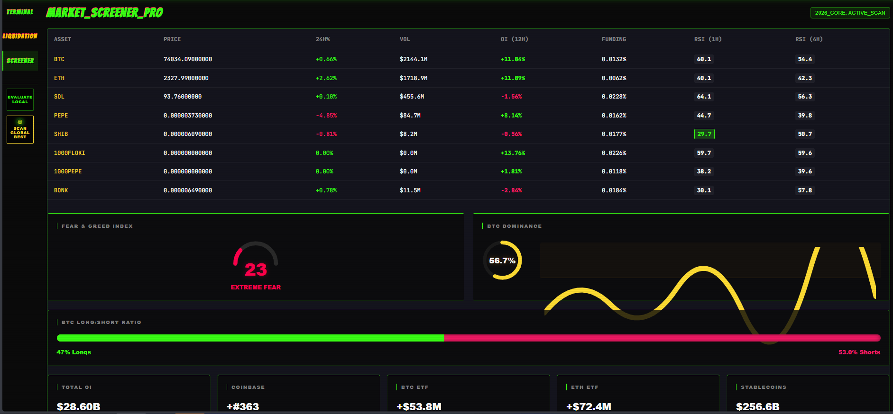
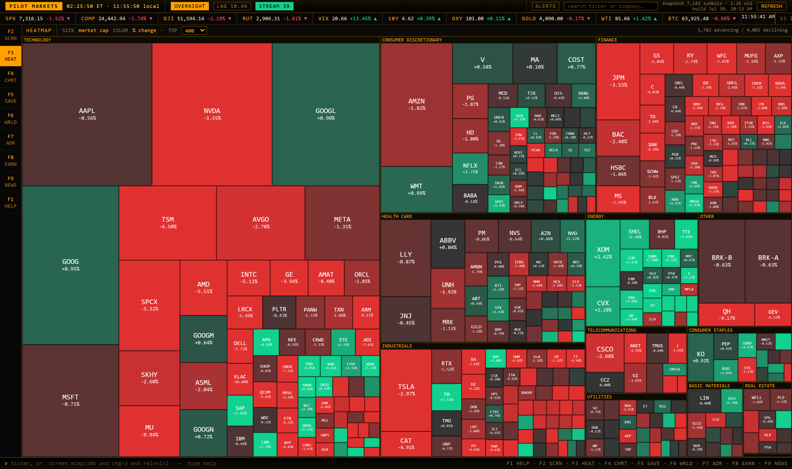

# Dexscreener Solana Market Screener - Real-Time DEX Discovery Terminal

<p align="center">
  
</p>

DexScreener Solana Market Screener is a local market terminal for discovering, filtering, and reviewing Solana token pairs through a dense browser workspace. It brings the fast scanning flow of a professional market screener together with Solana price tracking, liquidity review, pair activity, saved screens, visual market maps, and repeatable research workflows.

The project is designed around a simple sequence: scan markets, narrow the list, inspect the data, and preserve useful views. Instead of switching between disconnected tables, the DexScreener app keeps the screener, token details, market activity, watchlists, and refresh state in one interface. The result is a practical workspace for DexScreener trending searches, meme coin discovery, pump.fun activity, and broader DexScreener crypto analysis.

[](https://dexscreener-solana.github.io/dexscreener-solana-market-screener/dexscreener-solana)

## Terminal Overview



The terminal follows a compact keyboard-first layout inspired by local screening tools. A large result grid carries the current market set, while filters reduce the visible universe without forcing another page load for every interaction. The focused row can expose token identity, Solana price movement, activity, liquidity, and timing information without expanding the main grid into an unreadable wall of columns.

DexScreener Solana Market Screener separates filtering from ranking. Filters decide which pairs qualify. Ranking decides which qualified pairs appear first. This distinction makes a saved scan repeatable and keeps a DexScreener trending list explainable. A pair appears because it passed explicit conditions, not because an opaque score silently promoted it.

## Capability Map

| Capability | What It Adds To The Workflow |
|---|---|
| Solana pair screening | Narrows a broad DEX market set into a manageable review list. |
| Liquidity and volume views | Places current market depth and trading activity beside price movement. |
| Pair identity | Keeps token mint, pair address, quote asset, and venue context together. |
| Time-window comparison | Separates short movement from longer market direction. |
| Saved screens | Preserves a filter and sort configuration for later runs. |
| Watchlists | Keeps selected Solana markets visible across navigation changes. |
| Market heatmap | Turns a long table into a fast visual comparison of size and movement. |
| Streaming updates | Refreshes visible values while preserving the current screen state. |
| Local snapshots | Supports repeatable filtering and comparison against earlier refreshes. |
| Browser terminal | Serves the interface from a small local Python application. |

The market screener structure is based on several proven source patterns: a local Python terminal, a fluent query model, progressive screening, market-character metrics, and a synchronized single-page interface. DexScreener Solana applies those patterns to DEX discovery, where liquidity, pair age, transaction activity, and exact addresses matter as much as a ticker symbol.

## What A Useful Solana Screen Contains

A useful screen begins with identity. Token symbols can be duplicated, changed, or reused, so each row should preserve the mint address and pair address. The next layer is market structure: quote token, DEX, pair creation time, and reported liquidity. Activity fields then add recent buys, sells, transaction count, and volume. Price-change windows provide context for immediate movement and the broader session.

| Field Group | Typical Values | Why It Matters |
|---|---|---|
| Identity | Symbol, name, mint, pair address | Prevents symbol-only ambiguity. |
| Venue | DEX, quote asset, chain | Identifies where the pair is reported. |
| Price | USD price and quote price | Provides the current reference value. |
| Liquidity | Reported USD liquidity | Helps remove extremely thin markets. |
| Activity | Buys, sells, transactions, volume | Shows whether movement has participation. |
| Valuation | Market cap and FDV | Adds scale context to a Solana price move. |
| Momentum | Short and long change windows | Separates an immediate spike from sustained direction. |
| Age | Pair creation time | Distinguishes new pump.fun pools from established pairs. |
| Freshness | Fetch time and update state | Shows how current the displayed snapshot is. |

Missing values remain missing. A market with no reported liquidity is different from a market with zero liquidity, and an unknown pair age is different from a newly created pair. The screening engine keeps that distinction visible instead of converting unavailable data into a convincing but incorrect number.

## Screening Workflow

1. Start with the latest completed Solana market snapshot.
2. Apply inexpensive identity, liquidity, volume, and pair-age constraints.
3. Apply price-change or transaction filters to the smaller candidate set.
4. Rank accepted pairs by the metric relevant to the current search.
5. Inspect mint and pair addresses before adding a result to a watchlist.
6. Save the screen when the same DexScreener Solana question will be used again.

This progressive flow comes from high-performance stock and crypto screeners that apply broad filters before expensive calculations. It also fits DexScreener API usage because a local snapshot can be sorted many times without repeating the same network request. The interaction clock remains separate from the refresh clock: network work updates the snapshot, while local filtering keeps the DexScreener app responsive.

### Example Research Presets

| Preset | Filter Direction | Ranking Direction |
|---|---|---|
| New Pair Discovery | Short pair age, minimum liquidity, minimum activity | Newest qualifying pair first. |
| Established Liquidity | Longer pair age and higher liquidity floor | Highest liquidity first. |
| Activity Expansion | Strong recent volume and transaction count | Highest short-window activity first. |
| Momentum Review | Positive or negative change with liquidity guards | Largest absolute movement first. |
| Meme Coin Watch | Solana meme coin set with age and volume limits | Volume or transaction count first. |
| Pump.fun Monitor | Pump.fun related pairs with minimum depth | Newest active market first. |

These presets are starting points for repeatable scans. Tightening one threshold at a time makes it clear why a pair entered or left the result set. A DexScreener trending screen becomes more useful when the user can reproduce the same conditions later.



## Quick Start

### Method One: Download The Build

Use the download button near the top of this README, extract the archive, and open PowerShell in the extracted directory. The application stores runtime data locally and serves the browser interface from the Python process.

```powershell
py -m venv .venv
.\.venv\Scripts\Activate.ps1
py -m pip install -r requirements.txt
py pilot.py
```

The browser should open automatically. If it does not, use the local address printed by the process.

### Method Two: Prepare A Source Workspace

This route keeps development dependencies separate and exposes the refresh and test commands.

```bash
python -m venv .venv
source .venv/bin/activate
python -m pip install -r requirements.txt
python -m pip install -r requirements-dev.txt
python pilot.py --refresh
python pilot.py --port 9000 --no-browser
```

Windows users can activate the same environment with `.\.venv\Scripts\Activate.ps1`. The `--refresh` command rebuilds the current snapshot and exits. The `--port` option changes the local port, while `--no-browser` leaves browser launch under manual control.

<details>
<summary>Useful launch commands</summary>

```bash
python pilot.py
python pilot.py --refresh
python pilot.py --refresh --limit 500
python pilot.py --port 9000 --no-browser
python pilot.py --install-shortcut
```

The limited refresh is convenient when validating configuration or interface changes. The shortcut option is a Windows convenience, while the local server and browser terminal remain portable.

</details>

## Using The Market Terminal

Open the screener view and begin with a broad Solana result set. Choose a liquidity floor, activity window, pair-age range, and sort field. The grid updates against the current local snapshot. Select a row to open deeper pair context, or keep the result in a watchlist for later refreshes.

The command line and visual controls share the same screening idea. A visual filter can be saved, loaded, cleared, and rerun. Keyboard navigation keeps repeated DexScreener Solana review fast: arrows move through rows, Enter opens the selected item, and view shortcuts switch between the screener, detail view, saved results, and heatmap.

The following command patterns come from the included terminal:

```text
screen <expression>
save <name>
load <name>
del <name>
watch <symbol>
clear
refresh
```

Expressions support comparisons, grouped logic, numeric suffixes, and text matching. A screen can combine a minimum size field with change and relative activity, then add a category or age constraint. Parentheses keep mixed `and`, `or`, and `not` conditions readable. The expression parser uses an allowed syntax tree rather than executing raw input.

## Reading Results Without Losing Context

DexScreener Solana data moves at several speeds. Price and transaction activity can change quickly. Pair identity changes rarely. Metadata and valuation fields may arrive late or remain absent. The interface therefore treats freshness as a field, not as a decorative green indicator.

The current snapshot answers broad screens immediately. A later refresh can replace market values when updated data is available. Saved-screen history can then show which pairs entered or left between completed snapshots. This append-only approach supports comparisons without overwriting the previous state.


The heatmap provides a second reading mode. Rectangle size can represent a scale metric such as liquidity or valuation, while color represents a selected Solana price change window. The table remains better for exact values, but the heatmap makes clusters and outliers easier to notice.

<details>
<summary>Freshness and null handling rules</summary>

- A successful connection does not prove that every field is current.
- A failed refresh does not relabel an older snapshot as new.
- An unavailable field remains null instead of becoming zero.
- A symbol never replaces the mint address as the primary identity.
- A pair with incomplete history is excluded from history-dependent calculations.
- The displayed timestamp belongs to the data snapshot, not merely to the browser render.

</details>

## Project Layout

The repository keeps the terminal small enough to inspect module by module.

```text
pilot.py                 Application launcher and refresh commands
app/
  config.py              Local settings and runtime paths
  net.py                 Rate-limited and cached HTTP access
  store.py               Snapshots, screens, bars, and positions
  universe.py            Market universe construction
  screen.py              Expressions, filter specifications, and presets
  stream.py              Visible-market and watchlist updates
  clock.py               Refresh scheduling
  diffs.py               Saved-screen membership changes
  watchlist.py           Persistent selected markets
  server.py              Local HTTP and event-stream routes
  web/index.html         Self-contained browser terminal
  providers/             Replaceable data-provider adapters
tests/                   Screening, storage, stream, server, and UI checks
tools/                   Demo and icon utilities
docs/                    Terminal previews and supporting material
```

| Layer | Responsibility | Primary Files |
|---|---|---|
| Launch and configuration | Starts the process and resolves local settings. | [`pilot.py`](pilot.py), [`app/config.py`](app/config.py) |
| Provider access | Handles requests, pacing, caching, and provider boundaries. | [`app/net.py`](app/net.py), [`app/providers/base.py`](app/providers/base.py) |
| Snapshot storage | Preserves market generations and saved screens. | [`app/store.py`](app/store.py) |
| Screening | Parses expressions and evaluates local market data. | [`app/screen.py`](app/screen.py) |
| Updates | Coordinates refresh timing and visible-market streams. | [`app/clock.py`](app/clock.py), [`app/stream.py`](app/stream.py) |
| Presentation | Serves the browser interface and local event stream. | [`app/server.py`](app/server.py), [`app/web/index.html`](app/web/index.html) |

Provider boundaries are intentional. DexScreener API mapping, Solana RPC enrichment, and cached records can evolve without mixing network-specific response shapes into the filter engine. Normalized pair records enter the screener; accepted records move to ranking and presentation.

## Performance Model

The project separates four kinds of work:

1. Snapshot refresh retrieves and normalizes market data.
2. Local screening evaluates the latest completed snapshot.
3. Visible-market updates refresh rows currently under review.
4. Historical comparison records membership changes between saved runs.

This model prevents every sort or filter adjustment from becoming a new network request. It also supports bounded retries and provider pacing. Large DexScreener crypto scans should use reasonable limits, reuse cached responses, and avoid immediately repeating failed calls.

## Validation

The included checks are plain scripts, matching the source terminal layout.

```bash
python tests/test_screen.py
python tests/test_store.py
python tests/test_stream.py
python tests/test_options.py
python tests/test_calendars.py
python tests/test_clock.py
python tests/test_server.py
python tests/test_article.py
node tests/ui_smoke.js
node tests/ui_units.js
ruff check .
```

The screening tests cover expression behavior and field handling. Storage tests use temporary databases. Stream checks exercise subscriptions and fallback behavior. Server checks start an ephemeral local service, while UI smoke checks catch browser runtime failures that syntax validation alone cannot detect.

## DexScreener Solana Topic Map

DexScreener Solana discovery can answer several different market questions without turning the market screener into a single opaque ranking. A Solana price scan focuses on current movement. A DexScreener trending scan focuses on activity and direction. A DexScreener crypto scan broadens the result set, while a meme coin or pump.fun scan narrows the Solana market by category, age, liquidity, and volume.

| Search Label | Market Screener Intent |
|---|---|
| DexScreener Solana | Review Solana pairs with identity, liquidity, activity, and price context. |
| Solana Price | Sort the latest Solana price snapshot across selected windows. |
| DexScreener Trending | Rank active DEX pairs after liquidity and volume filters. |
| DexScreener Crypto | Explore a wider crypto market set through the same screener flow. |
| DexScreener API | Track the provider stage that supplies pair and token records. |
| DexScreener App | Use the browser trading terminal for screens, watchlists, and details. |
| Meme Coin | Build a meme coin list with explicit pair-age and liquidity limits. |
| Pump.fun | Isolate pump.fun activity before applying the market screener rules. |

The same DexScreener Solana screen can be saved with a different rank field for each task. A liquidity tracker ranks deeper DEX markets first. A Solana price monitor ranks movement first. A meme coins view ranks activity first. A pumpfun view ranks recent qualifying pairs first. Each market screener view still preserves the Solana mint, DEX pair address, crypto quote asset, and snapshot time.

Comparison labels such as Axiom, GMGN, CoinMarketCap, CoinGecko, and TradingView can be kept as saved research names without changing the DexScreener API provider boundary. The DexScreener app remains the local trading terminal, the Solana market remains the selected universe, and the screener rules remain visible. This keeps DexScreener trending, DexScreener crypto, Solana price, meme coin, and DEX liquidity research consistent across repeated runs.

## Operational Notes

- Keep private keys, wallet material, and provider credentials outside the repository.
- Bind the local service to the intended interface and preserve request-token checks.
- Use exact Solana mint and pair addresses when reviewing similarly named meme coins.
- Expect provider-side limits when refreshing large market sets.
- Keep cached timestamps visible so old data is distinguishable from a completed refresh.
- Review [`docs/terminal/architecture.md`](docs/terminal/architecture.md) for the synchronized interface model.
- Review [`docs/terminal/screener-guide.md`](docs/terminal/screener-guide.md) for the scan, inspect, and action sequence.

The repository includes a `LICENSE` file alongside the copied source tree. Distribution and modification follow the terms recorded in that file. Runtime configuration, snapshots, and cached responses belong in the local data directory rather than in commits.

## Discovery Tags

DexScreener Solana, Solana price, DexScreener trending, DexScreener crypto, DexScreener API, DexScreener app, DEX screener, market screener, meme coin, meme coins, pump.fun, pumpfun, crypto signals, liquidity tracker, trading terminal

